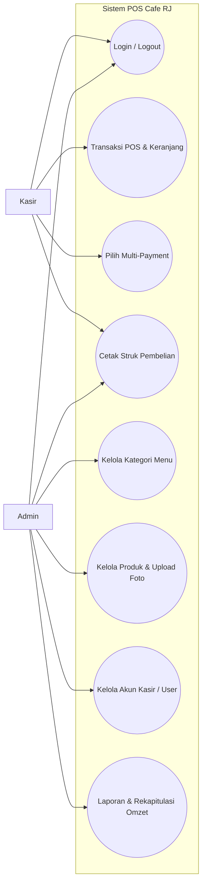
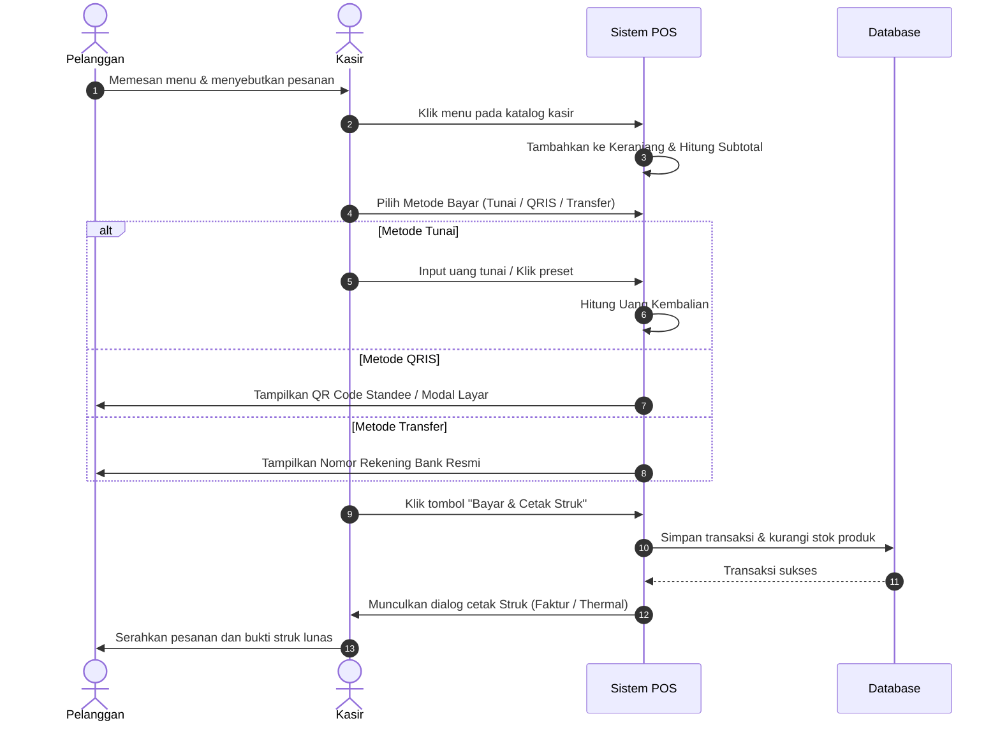
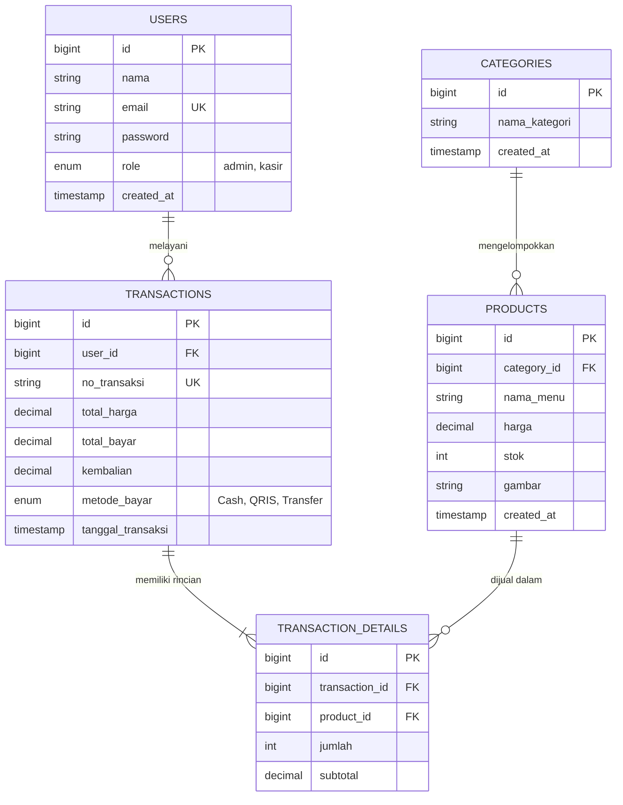

# DOKUMEN SPESIFIKASI KEBUTUHAN PERANGKAT LUNAK (SRS)
## SISTEM INFORMASI POINT OF SALE (POS) CAFE RJ

**Digitalisasi Transaksi Kasir, Multi-Payment (Tunai, QRIS, Transfer Bank), dan Rekapitulasi Penjualan Berbasis Web (Laravel 12 & MySQL)**

---

### Disusun Oleh:
- **Nama Tim / Pengembang:** Tim Pengembang Rekayasa Perangkat Lunak
- **Mata Pelajaran:** Rekayasa Perangkat Lunak (RPL)
- **Topik:** Pengembangan Aplikasi Berbasis Web
- **Instansi:** SMK Jurusan Pengembangan Perangkat Lunak dan GIM (PPLG)

---

## LEMBAR PENGESAHAN

Dokumen Spesifikasi Kebutuhan Perangkat Lunak (Software Requirements Specification - SRS) untuk sistem **Aplikasi Point of Sale (POS) Cafe RJ** ini telah diperiksa, dievaluasi, dan disahkan sebagai acuan perancangan dan implementasi perangkat lunak.

Disahkan di: ______________________  
Pada tanggal: ______________________

<br>

| Mengetahui / Menyetujui,<br>Guru Pembimbing / Penguji | Ketua Tim Pengembang / Siswa |
| :---: | :---: |
| <br><br><br><br>___________________________________<br>**NIP. -** | <br><br><br><br>___________________________________<br>**NIS. -** |

---

## DAFTAR ISI

- **BAB I: PENDAHULUAN**
  - A. Latar Belakang
  - B. Rumusan Masalah
  - C. Batasan Masalah
  - D. Tujuan
  - E. Nama Aplikasi
  - F. Definisi dan Singkatan
- **BAB II: LANDASAN TEORI**
  - A. Konsep Sistem Point of Sale (POS) dan Transaksi Cafe
  - B. Konsep Pengembangan Aplikasi Berbasis Web & Arsitektur MVC
  - C. Alat Bantu Perancangan Sistem (OOAD & UML)
  - D. Teknologi Pendukung (Laravel 12, PHP, MySQL, Tailwind CSS, Antigravity IDE)
- **BAB III: METODE PENGEMBANGAN**
  - A. Metode Pengembangan Sistem (Waterfall)
  - B. Analisis Kebutuhan Fungsional (Aktor Kasir & Aktor Admin)
  - C. Ketergantungan dan Spesifikasi Sistem (Hardware & Software)
  - D. Tabel Tools Pengembangan Perangkat Lunak
  - E. Perancangan Alur Sistem (UML & Data)
    - 1. Use Case Diagram
    - 2. Activity Diagram Transaksi Kasir
    - 3. Diagram Pendukung (ERD & DFD Level 0)
    - 4. Skenario Use Case Lengkap
  - F. Perancangan Antarmuka Pengguna (UI/UX Mockup)
- **KONTRAK KERJA PENGEMBANGAN SOFTWARE**
  - 1. Biaya Software
  - 2. Kontrak dan Perjanjian Kerja Sama

---

# BAB I: PENDAHULUAN

### A. LATAR BELAKANG
1. **Pencatatan Nota Transaksi Masih Konvensional:** Operasional kasir kedai kopi lokal selama ini mengandalkan nota kertas manual yang rentan hilang, robek, atau basah terkena tumpahan minuman.
2. **Potensi Kesalahan Hitung pada Jam Sibuk (*Rush Hour*):** Perhitungan total belanja dan uang kembalian secara manual saat antrean pelanggan memanjang sering memicu selisih kas fisik (*cash discrepancy*).
3. **Keterbatasan Dukungan Pembayaran Non-Tunai:** Perkembangan transaksi digital menuntut adanya opsi QRIS dan transfer bank yang terverifikasi langsung pada layar kasir tanpa memperlambat alur pelayanan.
4. **Keterlambatan Rekapitulasi Omzet:** Pemilik cafe kesulitan memantau pergerakan stok menu secara langsung (*real-time*) dan membutuhkan waktu lama untuk merekap laporan pendapatan harian dari tumpukan bon fisik.
5. **Kebutuhan Sistem Berbasis Web yang Responsif:** Diperlukan sistem digital kasir yang dapat beroperasi stabil di komputer desktop kasir maupun smartphone tanpa konfigurasi perangkat yang rumit.

---

### B. RUMUSAN MASALAH
1. Bagaimana merancang dan membangun sistem aplikasi kasir digital (POS) berbasis web menggunakan framework Laravel 12 dan database MySQL yang *user-friendly* dan responsif?
2. Bagaimana mengintegrasikan sistem transaksi multi-metode pembayaran (Tunai dengan kalkulasi kembalian otomatis, QRIS dinamis, dan Transfer Bank)?
3. Bagaimana kelayakan, akurasi, dan efektivitas aplikasi ini dalam mempercepat transaksi kasir serta menyajikan laporan omzet kepada pemilik cafe?

---

### C. BATASAN MASALAH
1. Aplikasi berjalan pada arsitektur web client-server dengan backend Laravel 12 dan database MySQL.
2. Pengguna aplikasi (*actors*) dibatasi pada 2 hak akses (multi-role): **Admin** (Pemilik/Manajer Cafe) dan **Kasir**.
3. Sistem pembayaran mencakup pembayaran Tunai (Cash), verifikasi statis/dinamis QRIS, dan Transfer Bank (BCA, Mandiri, BRI). Sistem tidak terhubung langsung ke payment gateway pihak ketiga berbayar (*free open-source approach*).
4. Output cetak struk difokuskan pada format faktur layar penuh (A4) dan format cetak printer thermal standar (80mm) via browser print engine.

---

### D. TUJUAN
1. Menghasilkan aplikasi kasir digital Point of Sale (POS) berbasis web yang fungsional, cepat, dan mudah dioperasikan oleh kasir.
2. Mengotomatisasi alur kalkulasi pesanan, pengurangan stok produk, dan pencatatan transaksi secara real-time.
3. Mengukur efektivitas dan kepuasan pengguna (pemilik cafe dan kasir) terhadap keandalan sistem.

---

### E. NAMA APLIKASI
Nama aplikasi dalam proyek ini adalah:  
**Sistem Informasi Point of Sale Cafe RJ (Cafe RJ POS)**

---

### F. DEFINISI DAN SINGKATAN

#### 1. Tabel Istilah
| No | Istilah | Definisi |
|---|---|---|
| 1 | **Point of Sale (POS)** | Sistem kasir berbasis perangkat lunak yang digunakan untuk mencatat pesanan, memproses pembayaran, dan mencetak bukti transaksi. |
| 2 | **Admin** | Pengguna dengan otoritas penuh atas seluruh master data (kategori, produk, user) dan laporan pendapatan cafe. |
| 3 | **Kasir** | Pengguna yang bertugas mengoperasikan terminal kasir POS untuk melayani pelanggan, memproses bayar, dan mencetak struk. |
| 4 | **Database** | Media penyimpanan data terstruktur yang memuat data pengguna, kategori, produk, transaksi, dan detail belanja. |
| 5 | **Subtotal** | Akumulasi nilai belanja dari perkalian antara harga satuan produk dengan jumlah item yang dipesan. |
| 6 | **Uang Kembalian** | Selisih lebih antara nominal uang tunai yang diserahkan pelanggan dengan total tagihan belanja. |
| 7 | **Struk / Invoice** | Bukti tertulis resmi transaksi pembelian yang memuat tanggal, daftar item, harga, total, kasir, dan metode pembayaran. |
| 8 | **Token CSRF** | Kunci keamanan unik acak per sesi browser untuk melindungi formulir transaksi kasir dari eksploitasi serangan siber. |

#### 2. Tabel Singkatan
| No | Singkatan | Kepanjangan |
|---|---|---|
| 1 | **API** | *Application Programming Interface* |
| 2 | **CRUD** | *Create, Read, Update, Delete* |
| 3 | **CSRF** | *Cross-Site Request Forgery* |
| 4 | **ERD** | *Entity Relationship Diagram* |
| 5 | **HTTP / HTTPS** | *Hypertext Transfer Protocol / Secure* |
| 6 | **MVC** | *Model - View - Controller* |
| 7 | **OOAD** | *Object-Oriented Analysis and Design* |
| 8 | **PDF** | *Portable Document Format* |
| 9 | **QRIS** | *Quick Response Code Indonesian Standard* |
| 10 | **RDBMS** | *Relational Database Management System* |
| 11 | **SQL** | *Structured Query Language* |
| 12 | **UI / UX** | *User Interface / User Experience* |
| 13 | **UML** | *Unified Modeling Language* |

---

# BAB II: LANDASAN TEORI

### A. KONSEP SISTEM POINT OF SALE (POS) DAN TRANSAKSI CAFE
Sistem *Point of Sale* (POS) merupakan titik sentral operasional bisnis ritel makanan dan minuman (*Food and Beverages* / F&B). Pada industri kedai kopi modern, sistem POS berfungsi menggantikan mesin kasir konvensional (*electronic cash register*) dengan sistem terintegrasi yang mencakup:
1. **Penyajian Menu Dinamis:** Mengelompokkan minuman dan makanan berdasarkan kategori sehingga kasir dapat memilih menu dalam hitungan detik.
2. **Kalkulasi Nilai Otomatis:** Menghitung total pembayaran secara instan tanpa risiko keliru hitung.
3. **Fleksibilitas Pembayaran Non-Tunai:** Menghadirkan opsi pembayaran QRIS dan transfer perbankan yang langsung terverifikasi sebelum struk dicetak.
4. **Manajemen Arus Kas Kasir:** Memastikan uang kas fisik seimbang dengan nilai transaksi tunai yang tercatat pada database.

---

### B. KONSEP PENGEMBANGAN APLIKASI BERBASIS WEB DAN ARSITEKTUR MVC
Aplikasi POS Cafe RJ dikembangkan menggunakan pola arsitektur **Model-View-Controller (MVC)** bawaan framework Laravel:
1. **Model:** Merepresentasikan struktur data, relasi tabel database, dan logika bisnis (misal: `Product.php`, `Category.php`, `Transaction.php`).
2. **View:** Berupa template antarmuka grafis yang berinteraksi langsung dengan pengguna menggunakan Blade Templating Engine (`index.blade.php`, `receipt.blade.php`).
3. **Controller:** Penghubung yang menerima request pengguna dari View, memproses data melalui Model, dan mengembalikan respons kembali ke antarmuka (`PosController.php`, `ProductController.php`).

Keunggulan pendekatan ini adalah pemisahan kode yang rapi (*separation of concerns*), kemudahan pelacakan *bug*, dan skalabilitas aplikasi di masa depan.

---

### C. ALAT BANTU PERANCANGAN SISTEM
Perancangan sistem menggunakan pendekatan *Object-Oriented Analysis and Design* (OOAD) dengan diagram standar *Unified Modeling Language* (UML):
1. **Use Case Diagram:** Memodelkan fungsi sistem dari sudut pandang aktor luar (Kasir dan Admin).
2. **Activity Diagram:** Memvisualisasikan alur kerja langkah demi langkah dalam satu proses bisnis (misal alur kasir memproses pesanan hingga cetak struk).
3. **Entity Relationship Diagram (ERD):** Memodelkan struktur data logis tabel basis data beserta kardinalitas relasi antar entitas (*one-to-many*).

---

### D. TEKNOLOGI PENDUKUNG
1. **Framework Laravel 12:** Framework PHP modern dengan performa tinggi, sistem routing ekspresif, proteksi keamanan bawaan (CSRF, XSS, SQL Injection), dan Eloquent ORM.
2. **Bahasa Pemrograman PHP 8.2+:** Bahasa backend utama dengan fitur *type-safety*, eksekusi cepat, dan kompatibilitas server tinggi.
3. **Database MySQL 8.x:** Sistem manajemen basis data relasional (RDBMS) tangguh berbasis tabel transaksional bertipe InnoDB yang menjamin konsistensi data penjualan.
4. **Tailwind CSS & Vanilla JavaScript:** Kombinasi styling utilitas ringan dengan interaktivitas JavaScript murni tanpa ketergantungan library berat, memastikan waktu muat (*page load time*) kasir di bawah 1 detik.
5. **Integrated Development Environment (IDE):** Visual Studio Code / Antigravity IDE untuk penulisan kode, manajemen terminal, dan pengujian aplikasi.

---

# BAB III: METODE PENGEMBANGAN

### A. METODE PENGEMBANGAN SISTEM (WATERFALL MODEL)
Pengembangan sistem POS Cafe RJ menggunakan metode **Waterfall (Model Air Terjun)** menurut Roger S. Pressman:

```
[Analisis Kebutuhan] ──► [Perancangan Sistem] ──► [Implementasi/Koding] ──► [Pengujian] ──► [Pemeliharaan]
```

1. **Analisis Kebutuhan (*Requirements Analysis*):** Mengidentifikasi kendala kasir cafe lokal dalam pencatatan manual dan merumuskan spesifikasi fitur MVP (Multi-role, POS Kasir, Multi-Payment, Cetak Struk, Laporan).
2. **Perancangan Sistem (*System Design*):** Membuat skema basis data (ERD), diagram Use Case, Activity Diagram, dan mockup antarmuka visual (UI/UX).
3. **Implementasi (*Coding*):** Mengembangkan kode program menggunakan Laravel 12, Blade Template, Tailwind CSS, dan database MySQL.
4. **Pengujian (*Integration & Testing*):** Menjalankan pengujian fungsionalitas fitur menggunakan metode *Black-Box Testing* untuk menjamin nihil *bug* (akurasi kalkulasi kembalian, cetak faktur, upload foto produk, dan penanganan CSRF error 419).
5. **Pemeliharaan (*Maintenance*):** Memastikan aplikasi berjalan stabil pada lingkungan operasional harian kedai kopi.

---

### B. ANALISIS KEBUTUHAN FUNGSIONAL

#### 1. Aktor: Kasir (Cashier)
- **Autentikasi:** Melakukan login akun kasir untuk membuka sesi kasir.
- **Katalog Menu:** Melihat daftar menu lengkap dengan filter kategori instan.
- **Keranjang Pesanan:** Menambahkan produk ke keranjang belanja, menaikkan/menurunkan kuantitas item, menghapus item, dan mengosongkan keranjang.
- **Kalkulasi Total Belanja:** Sistem otomatis menjumlahkan subtotal harga item yang dipesan secara real-time.
- **Pemilihan Metode Pembayaran:**
  - *Tunai:* Memasukkan nominal uang bayar atau menekan tombol pecahan cepat (+20rb, +50rb, +100rb, Uang Pas), sistem otomatis menghitung uang kembalian.
  - *QRIS:* Menampilkan QR Code resmi tagihan dan membuka modal layar perbesar pelanggan (*customer display*).
  - *Transfer Bank:* Menampilkan nomor rekening tujuan resmi (BCA, Mandiri, BRI) dengan fitur satu-klik salin nomor rekening.
- **Cetak Struk:** Mencetak bukti transaksi ke format Faktur Layar Penuh (A4) atau Struk Thermal 80mm setelah transaksi berhasil.
- **Riwayat Transaksi:** Melihat daftar transaksi yang telah diselesaikan.

#### 2. Aktor: Admin (Pemilik / Manajer)
- **Autentikasi:** Login akun admin dengan hak akses penuh (*super-privilege*).
- **Kelola Kategori Menu (CRUD):** Menambah, melihat, mengubah nama, dan menghapus kategori menu.
- **Kelola Produk/Menu (CRUD):** Menambah menu baru, menentukan harga jual, menentukan stok, memilih kategori, dan mengunggah foto menu dengan fitur *live preview*.
- **Kelola Pengguna/User (CRUD):** Mendaftarkan akun kasir baru, memperbarui sandi, dan menonaktifkan akun kasir.
- **Monitoring & Laporan Penjualan:** Memantau riwayat seluruh transaksi, memfilter rentang tanggal, dan melihat rekapitulasi omzet pendapatan kotor.

---

### C. SPESIFIKASI DAN KETERGANTUNGAN SISTEM

#### 1. Ketergantungan Software
- Memerlukan koneksi ke server database MySQL lokal (`caferj`) pada port 3306.
- Memerlukan browser dengan dukungan JavaScript aktif untuk kalkulasi keranjang kasir dinamis.
- Sesi autentikasi aman dengan batas *lifetime* 24 jam (1440 menit) untuk kelancaran shift operasional.

#### 2. Spesifikasi Minimum Perangkat Keras (Hardware)
- **Komputer Kasir / Laptop:** Processor Dual-Core 2.0 GHz, RAM 4 GB, Penyimpanan kosong 500 MB.
- **Perangkat Mobile / Tablet (Opsional):** RAM minimal 2 GB, layar sentuh responsif.
- **Printer Struk (Opsional):** Printer thermal USB/Bluetooth ukuran kertas 80mm atau printer laser/inkjet format A4.

#### 3. Spesifikasi Minimum Perangkat Lunak (Software)
- **Sistem Operasi:** Windows 10/11, macOS, atau Linux Ubuntu 22.04 LTS.
- **Web Server:** Apache / Nginx / PHP Built-in Server (`artisan serve`).
- **PHP Version:** PHP 8.2 atau lebih baru (ekstensi: `pdo_mysql`, `mbstring`, `fileinfo`, `gd`).
- **Database Server:** MySQL 8.0 atau MariaDB 10.4+.
- **Web Browser:** Google Chrome, Microsoft Edge, Mozilla Firefox versi terbaru.

---

### D. TABEL TOOLS PENGEMBANGAN APLIKASI

| No | Nama Tool | Klasifikasi | Fungsi Penggunaan |
|---|---|---|---|
| 1 | **Antigravity IDE / VS Code** | *Integrated Development Environment* | Editor utama penulisan kode, refactoring, dan debugging proyek Laravel 12. |
| 2 | **Laravel 12** | *Backend Web Framework* | Menangani arsitektur MVC, database ORM Eloquent, routing, autentikasi, dan kontrol keamanan. |
| 3 | **MySQL Server & phpMyAdmin** | *RDBMS & Database Manager* | Media penyimpanan tabel relasional transaksi, produk, dan pengguna. |
| 4 | **Tailwind CSS CDN** | *CSS Framework* | Mendesain antarmuka modern bernuansa *dark zinc* secara cepat dan responsif. |
| 5 | **Git & GitHub** | *Version Control System (VCS)* | Pengelolaan kode sumber, riwayat commit, dan publikasi repositori tim. |
| 6 | **Google Chrome & DevTools** | *Web Browser & Debugger* | Eksekusi antarmuka kasir, simulasi tampilan mobile, dan verifikasi console error/CSRF. |

---

### E. PERANCANGAN ALUR SISTEM (UML & DATA)

#### 1. Use Case Diagram
Menggambarkan hubungan antara aktor Kasir dan Admin dengan fungsionalitas sistem:



---

#### 2. Activity Diagram: Alur Transaksi Kasir
Menggambarkan alur langkah pemesanan hingga pencetakan struk:



---

#### 3. Diagram Pendukung

##### a. ERD (Entity Relationship Diagram)
Menjelaskan 5 tabel basis data dalam database `caferj`:



##### b. DFD (Data Flow Diagram) Konteks Level 0
```
                [Data Akun Login]
     Kasir ───────────────────────────► ┌─────────────────────────┐
           ◄─────────────────────────── │                         │
                [Tampilan POS & Struk]  │                         │ ◄──► (Database MySQL `caferj`)
                                        │   SISTEM POS CAFE RJ    │
                [Master Data & Filter]  │                         │
     Admin ───────────────────────────► │                         │
           ◄─────────────────────────── │                         │
                [Laporan Rekap Omzet]   └─────────────────────────┘
```

---

#### 4. Skenario Use Case Lengkap

##### a. Skenario Use Case: Login Multi-Role
- **Aktor:** Kasir / Admin
- **Tujuan:** Mengakses antarmuka sistem sesuai hak akses.
- **Pra-kondisi:** Pengguna membuka URL `/login` di browser.
- **Pasca-kondisi:** Pengguna dialihkan ke halaman dashboard admin atau kasir POS.

| Langkah Aktor | Respon Sistem |
|---|---|
| **Skenario Normal:** | |
| 1. Membuka halaman login. | 2. Menampilkan formulir input email dan password. |
| 3. Memasukkan email dan password valid. | |
| 4. Menekan tombol "Login". | 5. Sistem memvalidasi kredensial dan mencocokkan hash password bcrypt. |
| | 6. Jika role = `admin`, alihkan ke halaman Manajemen Menu.<br>Jika role = `kasir`, alihkan ke halaman Kasir POS. |
| **Skenario Alternatif:** | |
| 3a. Email atau password salah. | 4a. Sistem menampilkan notifikasi merah: *"Kredensial tidak valid."* dan tetap pada halaman login. |

---

##### b. Skenario Use Case: Transaksi Kasir POS
- **Aktor:** Kasir
- **Tujuan:** Memilih menu, memproses pembayaran pelanggan, dan menyimpan pesanan.
- **Pra-kondisi:** Kasir telah login dan berada di halaman kasir POS.
- **Pasca-kondisi:** Transaksi tersimpan ke basis data, stok berkurang, dan struk tercetak.

| Langkah Aktor | Respon Sistem |
|---|---|
| **Skenario Normal:** | |
| 1. Memilih kategori menu (misal: "Kopi"). | 2. Menampilkan daftar menu sesuai kategori yang dipilih. |
| 3. Mengklik kartu produk pesanan. | 4. Memasukkan item ke keranjang belanja dan mengalkulasi subtotal secara instan. |
| 5. Mengatur kuantitas item (`+` atau `-`). | 6. Memperbarui subtotal dan total tagihan belanja. |
| 7. Memilih tab metode pembayaran (Tunai / QRIS / Transfer). | 8. Menampilkan panel metode bayar yang dipilih dan menyembunyikan panel lainnya. |
| 9. Untuk tunai: Mengisi nominal uang yang diterima. | 10. Mengalkulasi nilai uang kembalian secara otomatis. |
| 11. Menekan tombol "Bayar & Cetak Struk". | 12. Sistem memverifikasi token CSRF, menyimpan data ke tabel `transactions` & `transaction_details`, mengurangi stok produk, dan membuka jendela cetak struk. |
| **Skenario Alternatif:** | |
| 11a. Kasir menekan bayar saat keranjang masih kosong. | 12a. Sistem menampilkan pesan error peringatan: *"Keranjang pesanan masih kosong!"*. |
| 11b. Uang tunai yang diinput kurang dari total tagihan. | 12b. Sistem menampilkan peringatan uang bayar kurang dan menolak pemrosesan transaksi. |

---

##### c. Skenario Use Case: Kelola Produk dan Upload Foto (Admin)
- **Aktor:** Admin
- **Tujuan:** Menambah atau memperbarui data produk beserta foto menu.
- **Pra-kondisi:** Admin telah login dan membuka menu `/admin/products`.
- **Pasca-kondisi:** Data produk tersimpan di database dan foto terunggah di storage.

| Langkah Aktor | Respon Sistem |
|---|---|
| **Skenario Normal:** | |
| 1. Memilih menu "Tambah Produk". | 2. Menampilkan formulir nama menu, kategori, harga, stok, dan upload gambar. |
| 3. Mengisi data dan memilih berkas gambar produk. | 4. Menampilkan *live image preview* dari file foto yang dipilih. |
| 5. Menekan tombol "Simpan Produk". | 6. Sistem memvalidasi input, menyimpan file foto ke `storage/app/public/products`, dan menyimpan record ke database. |
| | 7. Menampilkan pesan sukses dan memperbarui tabel data master. |

---

##### d. Skenario Use Case: Rekapitulasi Laporan Penjualan (Admin)
- **Aktor:** Admin
- **Tujuan:** Melihat riwayat transaksi dan memantau omzet kedai kopi.
- **Pra-kondisi:** Admin login dan membuka menu Laporan Penjualan.
- **Pasca-kondisi:** Data transaksi dan total omzet tersaji sesuai filter tanggal.

| Langkah Aktor | Respon Sistem |
|---|---|
| **Skenario Normal:** | |
| 1. Membuka menu Riwayat / Laporan Transaksi. | 2. Menampilkan seluruh data transaksi secara kronologis. |
| 3. Memasukkan filter tanggal awal dan tanggal akhir. | 4. Menjalankan query rekapitulasi data berdasarkan rentang waktu. |
| | 5. Menampilkan total nominal omzet, rata-rata transaksi, dan opsi cetak ulang struk. |

---

### F. PERANCANGAN ANTARMUKA PENGGUNA (UI/UX MOCKUP)

Dokumen perancangan antarmuka visual sistem POS Cafe RJ telah dilengkapi mockup resolusi tinggi:

1. **Antarmuka Kasir Utama (POS Cashier Screen):**  
   Tata letak *split-view* dua kolom modern berlatar *zinc/dark*, memuat navigasi kategori, katalog kartu foto menu 1:1 berharga IDR, keranjang pesanan interaktif, dan selector multi-metode bayar (*Tunai, QRIS, Transfer*).  
   *Berkas aset mockup:* `public/mockups/pos_cashier_mockup.jpg`

2. **Antarmuka Dashboard & Master Produk (Admin View):**  
   Dilengkapi kartu metrik indikator kinerja utama (Total Penjualan Hari Ini, Total Transaksi, Menu Terlaris, Sisa Stok Rendah) serta tabel CRUD master menu lengkap dengan thumbnail foto dan tombol aksi *Edit/Hapus*.  
   *Berkas aset mockup:* `public/mockups/admin_dashboard_mockup.jpg`

3. **Antarmuka Struk Pembelian (Receipt View):**  
   Mendukung dua mode tata letak cetak: Mode Faktur Layar Penuh (A4) untuk arsip resmi dan Mode Struk Mini (80mm) untuk printer thermal kasir.

---

# KONTRAK KERJA PENGEMBANGAN SOFTWARE

### 1. BIAYA SOFTWARE
*(Disesuaikan dengan kesepakatan anggaran riil antara pihak pengembang perangkat lunak dan pihak pemilik Cafe RJ / Instansi Sekolah).*

---

### 2. KONTRAK DAN PERJANJIAN KERJA SAMA
Yang bertanda tangan di bawah ini, **Pihak Pertama**:
- **Nama:** [Nama Pemilik Cafe RJ / Guru Penguji]
- **Jabatan:** Pemilik Cafe / Guru Pembimbing Proyek
- **Instansi:** Kedai Kopi Cafe RJ / SMK Jurusan PPLG

Dan **Pihak Kedua**:
- **Nama:** [Nama Ketua Tim Pengembang]
- **Jabatan:** Lead Developer / Project Manager
- **Instansi:** Tim Pengembang Perangkat Lunak RPL

Melalui dokumen ini, **Pihak Pertama** dan **Pihak Kedua** bersepakat dengan ketentuan sebagai berikut:
1. Pihak Kedua bertindak sebagai pengembang perangkat lunak *Sistem Informasi Point of Sale (POS) Cafe RJ* untuk Pihak Pertama.
2. Kebutuhan perangkat lunak yang diminta oleh Pihak Pertama telah dianalisis secara terperinci oleh Pihak Kedua dan seluruhnya telah didokumentasikan di dalam dokumen SRS ini.
3. Seluruh kebutuhan fungsional dan non-fungsional yang dirincikan dalam dokumen SRS ini telah disepakati oleh Pihak Pertama.
4. Penyelesaian perangkat lunak dilaksanakan secara terukur menggunakan metode *Waterfall* dengan cakupan fitur MVP (Autentikasi Multi-Role, Master Data Produk/Kategori, Transaksi Kasir POS Multi-Payment, Cetak Struk, dan Rekapitulasi Laporan Penjualan).
5. Kode sumber (*source code*) resmi telah diselesaikan dan tersimpan pada repositori publik: `https://github.com/yanzyuyu/caferj.git`.
6. Dokumen ini ditandatangani oleh kedua belah pihak dalam keadaan sadar, sehat jasmani dan rohani, serta tanpa paksaan dari pihak manapun.

<br>

| Pihak Pertama,<br>Pemilik Cafe RJ / Guru Penguji | Pihak Kedua,<br>Lead Developer / Ketua Tim |
| :---: | :---: |
| <br><br><br><br>___________________________________<br>**(Tanda Tangan & Nama Terang)** | <br><br><br><br>___________________________________<br>**(Tanda Tangan & Nama Terang)** |
