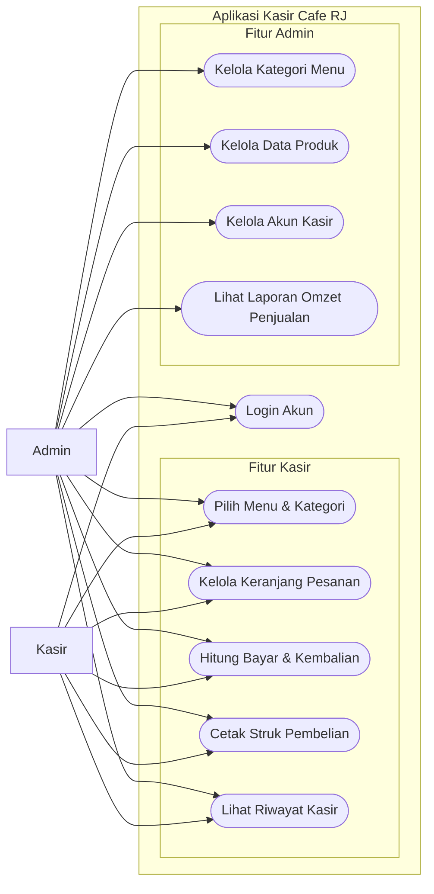
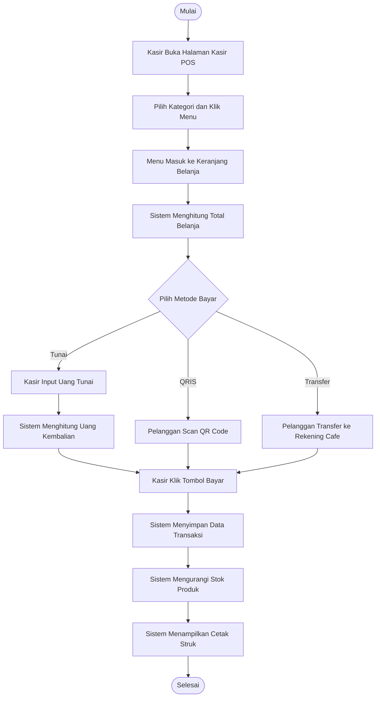
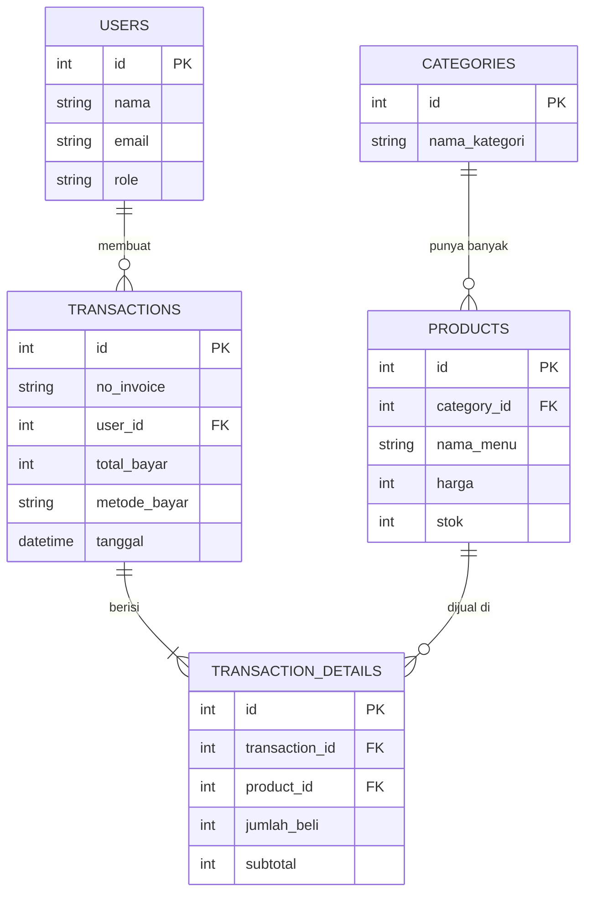
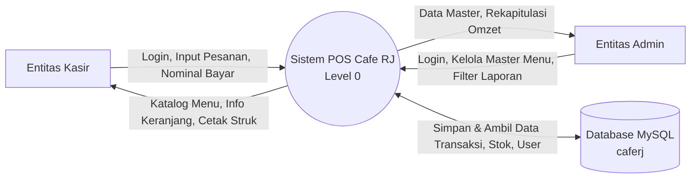

# SPESIFIKASI KEBUTUHAN PERANGKAT LUNAK (SRS)
## SISTEM INFORMASI POINT OF SALE (POS) CAFE RJ

**Aplikasi Kasir Digital, Multi-Metode Pembayaran (Tunai, QRIS, Transfer Bank), dan Rekapitulasi Penjualan Berbasis Web (Laravel 12 & MySQL)**

---

### Identitas Proyek Tugas Sekolah:
- **Mata Pelajaran:** Rekayasa Perangkat Lunak (RPL) / Pemrograman Berbasis Web
- **Topik:** Rancang Bangun Sistem POS Cafe Berbasis Web
- **Kelas / Jurusan:** Pengembangan Perangkat Lunak dan GIM (PPLG)
- **Nama Tim / Anggota:**
  1. [Nama Anggota 1 / Ketua Kelompok - NIS]
  2. [Nama Anggota 2 - NIS]
  3. [Nama Anggota 3 - NIS]
  4. [Nama Anggota 4 - NIS]
- **Sekolah:** SMK [Nama Sekolah Anda]
- **Tahun Ajaran:** 2026/2027

---

## LEMBAR PENGESAHAN PROYEK

Tugas Proyek Rancang Bangun Perangkat Lunak dengan judul **Sistem Informasi Point of Sale (POS) Cafe RJ** ini telah diselesaikan, diuji, dan disahkan untuk memenuhi penilaian mata pelajaran Rekayasa Perangkat Lunak (RPL).

Disahkan di: [Nama Kota]  
Pada tanggal: ........................................ 2026

<br>

| Guru Pembimbing / Penguji | Ketua Kelompok / Siswa |
| :---: | :---: |
| <br><br><br><br>___________________________________<br>**NIP. ........................................** | <br><br><br><br>___________________________________<br>**NIS. ........................................** |

---

## DAFTAR ISI

- **BAB I: PENDAHULUAN**
  - A. Latar Belakang Masalah
  - B. Rumusan Masalah
  - C. Batasan Masalah
  - D. Tujuan Pengembangan
  - E. Nama dan Deskripsi Aplikasi
  - F. Definisi Istilah dan Singkatan
- **BAB II: LANDASAN TEORI**
  - A. Konsep Point of Sale (POS) Kasir Kedai Kopi
  - B. Konsep Arsitektur Web Model-View-Controller (MVC)
  - C. Alat Bantu Perancangan (UML dan ERD)
  - D. Teknologi Pengembangan (Laravel 12, PHP, MySQL, Tailwind CSS)
- **BAB III: METODE DAN PERANCANGAN SISTEM**
  - A. Metode Pengembangan (Model Waterfall)
  - B. Analisis Kebutuhan Pengguna (Role Kasir dan Role Admin)
  - C. Spesifikasi Minimum Perangkat Keras dan Perangkat Lunak
  - D. Tabel Alat Pengembangan (Development Tools)
  - E. Pemodelan Sistem (UML & Aliran Data)
    - 1. Use Case Diagram
    - 2. Activity Diagram (Alur Transaksi Kasir)
    - 3. Entity Relationship Diagram (ERD)
    - 4. Data Flow Diagram (DFD Konteks Level 0)
    - 5. Tabel Skenario Use Case
  - F. Perancangan Antarmuka Pengguna (UI/UX Mockup)
- **BAB IV: LEMBAR EVALUASI DAN PENILAIAN GURU**
  - A. Rubrik Penilaian Proyek
  - B. Lembar Catatan dan Feedback Penguji

---

# BAB I: PENDAHULUAN

### A. LATAR BELAKANG MASALAH
1. **Pencatatan Transaksi Masih Manual:** Operasional kedai kopi Cafe RJ selama ini masih mengandalkan pencatatan nota kertas. Hal ini berisiko nota hilang, rusak, atau basah terkena tumpahan minuman.
2. **Antrean Menumpuk dan Rawan Salah Hitung:** Pada jam sibuk (rush hour), kasir kesulitan menghitung subtotal dan uang kembalian secara cepat dengan kalkulator manual, sehingga rawan selisih kas fisik.
3. **Kebutuhan Transaksi Non-Tunai:** Pelanggan semakin sering menggunakan pembayaran QRIS dan transfer perbankan. Tanpa sistem kasir digital, kasir harus berganti perangkat untuk memeriksa nominal belanja.
4. **Rekapitulasi Omzet Memakan Waktu:** Pemilik cafe membutuhkan waktu lama setiap tutup toko untuk menjumlahkan nota kertas satu per satu guna mengetahui omzet harian.
5. **Kebutuhan Sistem Web yang Responsif:** Diperlukan aplikasi kasir digital yang ringan, mudah diakses lewat komputer kasir maupun handphone, serta aman digunakan sepanjang jam kerja.

---

### B. RUMUSAN MASALAH
1. Bagaimana merancang dan membangun aplikasi kasir digital (POS) berbasis web dengan Laravel 12 dan MySQL yang mudah digunakan oleh kasir?
2. Bagaimana mengintegrasikan sistem kasir dengan tiga metode pembayaran (Tunai, QRIS, dan Transfer Bank)?
3. Bagaimana mengotomatisasi pencatatan transaksi, pengurangan stok, dan pencetakan struk belanja secara instan?

---

### C. BATASAN MASALAH
1. Aplikasi dibangun berbasis web menggunakan framework Laravel 12 dan database MySQL.
2. Hak akses sistem dibagi menjadi 2 peran pengguna (multi-role): **Admin** (Pemilik Cafe) dan **Kasir**.
3. Transaksi pembayaran mencakup 3 metode: Tunai (otomatis hitung kembalian), QRIS (tampilan standee dan modal pembesar), serta Transfer Bank manual (BCA, Mandiri, BRI).
4. Fitur cetak struk menghasilkan format Faktur Layar Penuh (A4) dan format cetak Struk Mini Thermal (80mm) melalui browser print service.

---

### D. TUJUAN PENGEMBANGAN
1. Menghasilkan aplikasi kasir POS Cafe berbasis web yang fungsional, cepat, dan responsif.
2. Membantu kasir memproses pesanan dan menghitung uang kembalian secara otomatis dan akurat.
3. Membantu pemilik cafe memantau riwayat transaksi dan laporan omzet penjualan kapan saja.

---

### E. NAMA DAN DESKRIPSI APLIKASI
Nama aplikasi ini adalah **Sistem Informasi Point of Sale Cafe RJ (Cafe RJ POS)**. Aplikasi ini dirancang untuk mendigitalkan seluruh alur kasir dari pemilihan menu, keranjang belanja, proses pembayaran, hingga cetak struk belanja.

---

### F. DEFINISI ISTILAH DAN SINGKATAN

#### 1. Tabel Istilah
| No | Istilah | Pengertian |
|---|---|---|
| 1 | Point of Sale (POS) | Sistem kasir berbasis software untuk melayani transaksi pembelian pelanggan. |
| 2 | Admin | Pengguna yang memiliki hak akses penuh mengelola produk, kategori, user, dan laporan. |
| 3 | Kasir | Pengguna yang bertugas mengoperasikan kasir, menerima pesanan, dan mencetak struk. |
| 4 | Database | Tempat penyimpanan data produk, kategori, user, dan transaksi. |
| 5 | Subtotal | Nilai total harga dari kuantitas item yang dibeli. |
| 6 | Uang Kembalian | Selisih uang yang dikembalikan ke pelanggan saat bayar tunai melebihi total belanja. |
| 7 | Struk / Invoice | Tanda bukti pembayaran sah yang memuat rincian transaksi belanja. |

#### 2. Tabel Singkatan
| No | Singkatan | Kepanjangan |
|---|---|---|
| 1 | CRUD | Create, Read, Update, Delete |
| 2 | ERD | Entity Relationship Diagram |
| 3 | DFD | Data Flow Diagram |
| 4 | MVC | Model - View - Controller |
| 5 | PHP | Hypertext Preprocessor |
| 6 | QRIS | Quick Response Code Indonesian Standard |
| 7 | RDBMS | Relational Database Management System |
| 8 | UI / UX | User Interface / User Experience |
| 9 | UML | Unified Modeling Language |

---

# BAB II: LANDASAN TEORI

### A. KONSEP POINT OF SALE (POS) KASIR KEDAI KOPI
Sistem Point of Sale (POS) adalah peranti utama dalam bisnis makanan dan minuman (F&B) untuk mencatat penjualan. Sistem POS modern menggantikan fungsi mesin kasir register manual dengan keunggulan:
- Menampilkan foto menu dan kategori produk untuk mempercepat pemilihan item.
- Menghitung nilai pesanan secara otomatis tanpa kalkulator manual.
- Mengurangi stok menu secara otomatis setiap transaksi berhasil diselesaikan.

---

### B. KONSEP ARSITEKTUR WEB MODEL-VIEW-CONTROLLER (MVC)
Aplikasi ini dibangun menggunakan pola desain perangkat lunak Model-View-Controller (MVC) bawaan framework Laravel:
- **Model:** Mengatur struktur data dan relasi tabel basis data (Category, Product, User, Transaction, TransactionDetail).
- **View:** Mengatur tampilan antarmuka pengguna berbasis Blade Templating Engine.
- **Controller:** Mengatur logika bisnis, memproses masukan kasir, dan menghubungkan Model dengan View (PosController, ProductController, AuthController).

---

### C. ALAT BANTU PERANCANGAN SISTEM
1. **Unified Modeling Language (UML):** Bahasa pemodelan visual untuk merancang sistem berorientasi objek (Use Case Diagram dan Activity Diagram).
2. **Entity Relationship Diagram (ERD):** Diagram relasi antar entitas basis data untuk memetakan struktur tabel MySQL.
3. **Data Flow Diagram (DFD):** Diagram alur pertukaran data antara pengguna luar dengan sistem kasir.

---

### D. TEKNOLOGI PENGEMBANGAN
1. **Laravel 12:** Framework backend PHP terkini dengan sistem keamanan bawaan dan performa tinggi.
2. **PHP 8.2+:** Bahasa pemrograman backend utama.
3. **MySQL 8.x:** Basis data relasional (RDBMS) untuk menyimpan data transaksi cafe secara aman.
4. **Tailwind CSS:** Framework CSS utilitas untuk tampilan antarmuka yang modern, bersih, dan responsif.
5. **Visual Studio Code / Antigravity IDE:** Perangkat lunak editor kode selama proses pembuatan aplikasi.

---

# BAB III: METODE DAN PERANCANGAN SISTEM

### A. METODE PENGEMBANGAN (MODEL WATERFALL)
Pengembangan sistem menggunakan model sekuensial Waterfall yang terdiri dari 5 tahapan terstruktur:
1. **Analisis Kebutuhan (Requirement Analysis):** Mengidentifikasi fitur wajib sesuai lembar tugas sekolah (Autentikasi Multi-Role, Master Data, Kasir POS, Cetak Struk, Laporan).
2. **Perancangan Sistem (System Design):** Merancang Use Case Diagram, Activity Diagram, skema basis data (ERD), DFD, dan mockup antarmuka pengguna.
3. **Pengodean (Coding/Implementation):** Menulis kode program dengan Laravel 12, Blade Template, dan MySQL.
4. **Pengujian (Testing):** Menguji fungsionalitas aplikasi dengan metode Black-Box Testing untuk memastikan kalkulasi kembalian akurat dan bebas error.
5. **Pemeliharaan (Maintenance):** Mengoptimalkan performa halaman kasir agar responsif di komputer maupun handphone.

---

### B. ANALISIS KEBUTUHAN PENGGUNA (ACTORS)

#### 1. Kebutuhan Role Kasir:
- Dapat melakukan login ke sistem.
- Dapat melihat menu berdasarkan kategori (Semua Menu, Kopi, Non-Kopi, Makanan Ringan).
- Dapat menambahkan menu ke keranjang pesanan dan mengatur jumlah item.
- Dapat memilih 3 opsi pembayaran: Tunai (hitung kembalian), QRIS (scan barcode), dan Transfer Bank.
- Dapat memproses transaksi dan mencetak struk belanja (format faktur A4 dan mini thermal).
- Dapat melihat riwayat transaksi kasir.

#### 2. Kebutuhan Role Admin:
- Dapat melakukan login dengan hak akses penuh.
- Dapat mengelola kategori menu (tambah, lihat, edit, hapus).
- Dapat mengelola data produk (tambah, edit, hapus, atur stok, dan upload foto produk).
- Dapat mengelola data akun kasir.
- Dapat melihat ringkasan omzet dan laporan seluruh transaksi penjualan dengan filter tanggal.

---

### C. SPESIFIKASI MINIMUM SISTEM

#### 1. Perangkat Keras (Hardware) Minimal:
- Komputer Kasir / Laptop: Processor Dual Core, RAM 4 GB, Ruang Penyimpanan 500 MB.
- Smartphone / Tablet Kasir (Alternatif): RAM minimal 2 GB.
- Printer Struk (Opsional): Printer thermal kasir 80mm atau printer biasa ukuran A4.

#### 2. Perangkat Lunak (Software) Minimal:
- Sistem Operasi: Windows 10/11, macOS, atau Linux.
- Web Server: Apache / Nginx / PHP Built-in Server.
- PHP Version: PHP ^8.2 (ekstensi: pdo_mysql, fileinfo, gd).
- Database: MySQL versi 8.0 atau MariaDB 10.4+.
- Web Browser: Google Chrome, Microsoft Edge, atau Mozilla Firefox.

---

### D. TABEL ALAT PENGEMBANGAN (DEVELOPMENT TOOLS)

| No | Nama Alat | Jenis | Kegunaan |
|---|---|---|---|
| 1 | Visual Studio Code / Antigravity IDE | Text Editor / IDE | Menulis dan mengedit kode program aplikasi. |
| 2 | Laravel 12 | Web Framework | Mengelola backend, routing, controller, dan autentikasi. |
| 3 | MySQL Server & phpMyAdmin | Database Management | Tempat menyimpan tabel-tabel data sistem. |
| 4 | Tailwind CSS CDN | Framework CSS | Mengatur tata letak dan desain visual kasir. |
| 5 | Git & GitHub | Version Control System | Menyimpan revisi kode dan pengumpulan tugas proyek. |
| 6 | Google Chrome Browser | Web Browser & DevTools | Menguji tampilan halaman web di layar desktop dan HP. |

---

### E. PEMODELAN SISTEM (UML & ALIRAN DATA)

#### 1. Use Case Diagram
Menjelaskan pembagian hak akses fitur antara Aktor Kasir dan Aktor Admin:



*Tabel Pemetaan Hak Akses Aktor:*
| Fitur / Use Case | Kasir | Admin |
|---|:---:|:---:|
| 1. Login Akun | Ya | Ya |
| 2. Pilih Menu & Kategori | Ya | Ya |
| 3. Kelola Keranjang Pesanan | Ya | Ya |
| 4. Hitung Bayar & Kembalian | Ya | Ya |
| 5. Cetak Struk Pembelian | Ya | Ya |
| 6. Lihat Riwayat Kasir | Ya | Ya |
| 7. Kelola Kategori Menu (CRUD) | Tidak | Ya |
| 8. Kelola Data Produk & Foto (CRUD) | Tidak | Ya |
| 9. Kelola Akun Kasir (CRUD) | Tidak | Ya |
| 10. Lihat Laporan Omzet Penjualan | Tidak | Ya |

---

#### 2. Activity Diagram: Alur Transaksi Kasir
Menjelaskan urutan langkah kasir melayani transaksi dari awal sampai cetak struk:



---

#### 3. Entity Relationship Diagram (ERD)
Menjelaskan 5 tabel basis data MySQL yang saling berelasi pada database `caferj`:



---

#### 4. Data Flow Diagram (DFD Konteks Level 0)
Menjelaskan aliran pertukaran data antara pengguna luar (Kasir dan Admin) dengan sistem aplikasi dan basis data:



---

#### 5. Tabel Skenario Use Case

##### Skenario Use Case 1: Login Akun
- **Aktor:** Kasir / Admin
- **Tujuan:** Masuk ke dalam sistem sesuai hak akses.
- **Kondisi Awal:** Pengguna berada di halaman form login.
- **Kondisi Akhir:** Pengguna masuk ke halaman kasir atau halaman admin.

| No | Aksi Pengguna (Aktor) | Respon Sistem |
|---|---|---|
| 1 | Membuka halaman login. | Menampilkan form input email dan password. |
| 2 | Memasukkan email dan password yang valid. | |
| 3 | Menekan tombol "Login". | Memvalidasi kecocokan data pengguna. |
| 4 | | Mengarahkan ke Kasir POS (jika Kasir) atau Admin (jika Admin). |
| *Alt* | *Memasukkan data salah.* | *Menampilkan pesan error: "Kredensial tidak valid".* |

##### Skenario Use Case 2: Transaksi Pembelian di Kasir
- **Aktor:** Kasir
- **Tujuan:** Memilih menu pesanan, menerima pembayaran, dan mencetak struk.
- **Kondisi Awal:** Kasir sudah login dan membuka halaman POS.
- **Kondisi Akhir:** Transaksi tersimpan ke database, stok berkurang, struk belanja dicetak.

| No | Aksi Pengguna (Aktor) | Respon Sistem |
|---|---|---|
| 1 | Memilih kategori dan mengklik menu pesanan. | Memasukkan item ke daftar keranjang belanja. |
| 2 | Mengatur jumlah beli item (+ atau -). | Menghitung subtotal dan total harga belanja. |
| 3 | Memilih metode bayar (Tunai, QRIS, Transfer). | Menampilkan formulir bayar yang sesuai. |
| 4 | (Jika tunai) Memasukkan jumlah uang diterima. | Otomatis menghitung dan menampilkan uang kembalian. |
| 5 | Menekan tombol "Bayar & Cetak Struk". | Memvalidasi dan menyimpan transaksi ke database. |
| 6 | | Mengurangi stok produk dan memunculkan jendela cetak struk. |
| *Alt* | *Menekan bayar saat keranjang masih kosong.* | *Sistem menolak dan menampilkan peringatan keranjang kosong.* |

##### Skenario Use Case 3: Pengelolaan Data Produk (Admin)
- **Aktor:** Admin
- **Tujuan:** Menambah atau memperbarui data menu dan foto menu cafe.
- **Kondisi Awal:** Admin telah login dan berada di menu Manajemen Produk.
- **Kondisi Akhir:** Data menu dan foto berhasil tersimpan di database dan folder storage.

| No | Aksi Pengguna (Aktor) | Respon Sistem |
|---|---|---|
| 1 | Mengklik tombol "Tambah Menu". | Menampilkan formulir input produk. |
| 2 | Mengisi nama menu, kategori, harga, stok. | |
| 3 | Memilih berkas foto menu dari komputer. | Menampilkan pratinjau (live preview) foto. |
| 4 | Mengklik tombol "Simpan Produk". | Menyimpan file foto ke storage dan data ke database MySQL. |
| 5 | | Menampilkan notifikasi sukses dan memperbarui tabel menu. |

##### Skenario Use Case 4: Laporan Penjualan (Admin)
- **Aktor:** Admin
- **Tujuan:** Memantau perolehan omzet dan riwayat transaksi.
- **Kondisi Awal:** Admin telah login dan membuka menu Laporan Penjualan.
- **Kondisi Akhir:** Laporan omzet dan riwayat transaksi tampil sesuai filter tanggal.

| No | Aksi Pengguna (Aktor) | Respon Sistem |
|---|---|---|
| 1 | Membuka menu Laporan Penjualan. | Menampilkan daftar seluruh transaksi yang telah terjadi. |
| 2 | Menentukan filter tanggal awal dan akhir. | Menjalankan query rekapitulasi data penjualan. |
| 3 | Menekan tombol "Filter". | Menampilkan total omzet kotor dan rincian transaksi belanja. |

---

### D. PERANCANGAN MOCKUP / WIREFRAME (HITAM PUTIH - LOW FIDELITY)

Bagian ini menyajikan rancangan kerangka kasar dasar antarmuka (*wireframe* monokrom hitam putih) untuk memetakan tata letak fungsional komponen sebelum diberi desain warna dan styling visual akhir. Tersedia 3 bagian mockup hitam putih:

#### 1. Mockup / Wireframe Hitam Putih 1: Terminal Kasir POS Utama
Memetakan tata letak bilah kategori menu, susunan grid kartu produk, serta panel keranjang belanja dan tombol checkout.

```
+-------------------------------------------------------------------------+
|                                                                         |
|         [ TEMPELKAN MOCKUP 1: WIREFRAME HITAM PUTIH KASIR POS ]         |
|                                                                         |
|  (File tersedia di: docs/wireframe_kasir_pos.png)                       |
|                                                                         |
+-------------------------------------------------------------------------+
```
*Gambar 3.5: Wireframe Hitam Putih 1 - Terminal Kasir POS Utama*

---

#### 2. Mockup / Wireframe Hitam Putih 2: Panel Administrator dan Master Data
Memetakan tata letak sidebar menu admin, 4 kartu ringkasan omzet, serta tabel master data produk cafe.

```
+-------------------------------------------------------------------------+
|                                                                         |
|        [ TEMPELKAN MOCKUP 2: WIREFRAME HITAM PUTIH PANEL ADMIN ]        |
|                                                                         |
|  (File tersedia di: docs/wireframe_admin_dashboard.png)                 |
|                                                                         |
+-------------------------------------------------------------------------+
```
*Gambar 3.6: Wireframe Hitam Putih 2 - Panel Administrator dan Master Data*

---

#### 3. Mockup / Wireframe Hitam Putih 3: Modal Pembayaran QRIS Pelanggan
Memetakan tata letak kotak dialog pembesar kode barcode QRIS agar pelanggan mudah memindai pembayaran.

```
+-------------------------------------------------------------------------+
|                                                                         |
|         [ TEMPELKAN MOCKUP 3: WIREFRAME HITAM PUTIH MODAL QRIS ]        |
|                                                                         |
|  (File tersedia di: docs/wireframe_pembayaran_qris.png)                 |
|                                                                         |
+-------------------------------------------------------------------------+
```
*Gambar 3.7: Wireframe Hitam Putih 3 - Modal Pembayaran QRIS Pelanggan*

---

### E. PERANCANGAN UI/UX & HASIL TAMPILAN WEB (FULL COLOR - HIGH FIDELITY)

Bagian ini menyajikan hasil implementasi antarmuka pengguna (UI/UX) akhir yang sudah berwarna penuh (*full color*), berfoto produk asli, dan aktif beroperasi pada sistem web Cafe RJ POS. Tersedia 3 bagian tampilan UI/UX web:

#### 1. UI/UX Hasil Tampilan Web 1: Terminal Kasir POS Aktif
Tampilan kasir aktif di browser web dengan nuansa gelap (*dark zinc*), katalog foto menu berharga IDR, stepper keranjang, dan tab pembayaran multi-metode.

```
+-------------------------------------------------------------------------+
|                                                                         |
|          [ TEMPELKAN UI/UX 1: HASIL TAMPILAN WEB KASIR POS ]            |
|                                                                         |
|  (File tersedia di: docs/pos_cashier_mockup.jpg)                        |
|                                                                         |
+-------------------------------------------------------------------------+
```
*Gambar 3.8: UI/UX Tampilan Web 1 - Terminal Kasir POS Aktif (Full Color)*

---

#### 2. UI/UX Hasil Tampilan Web 2: Dashboard & Manajemen Produk Admin
Tampilan panel admin aktif di browser web dengan metrik penjualan real-time serta tabel CRUD master menu lengkap dengan thumbnail gambar.

```
+-------------------------------------------------------------------------+
|                                                                         |
|        [ TEMPELKAN UI/UX 2: HASIL TAMPILAN WEB DASHBOARD ADMIN ]        |
|                                                                         |
|  (File tersedia di: docs/admin_dashboard_mockup.jpg)                    |
|                                                                         |
+-------------------------------------------------------------------------+
```
*Gambar 3.9: UI/UX Tampilan Web 2 - Dashboard dan Manajemen Produk Admin (Full Color)*

---

#### 3. UI/UX Hasil Tampilan Web 3: Format Cetak Struk Belanja & Bukti Lunas
Tampilan dokumen bukti transaksi sah hasil cetak sistem kasir (mode Faktur Layar Penuh A4 atau Struk Mini Thermal 80mm).

```
+-------------------------------------------------------------------------+
|                                                                         |
|        [ TEMPELKAN UI/UX 3: HASIL CETAK STRUK / BUKTI TRANSAKSI ]       |
|                                                                         |
|  (Tangkapan layar hasil cetak struk dari browser kasir POS)             |
|                                                                         |
+-------------------------------------------------------------------------+
```
*Gambar 3.10: UI/UX Tampilan Web 3 - Hasil Cetak Struk Belanja Transaksi*

---

# BAB IV: LEMBAR EVALUASI DAN PENILAIAN GURU

Lembar ini digunakan oleh guru pembimbing / penguji untuk memberikan evaluasi dan penilaian terhadap hasil proyek perangkat lunak yang dibangun oleh kelompok siswa.

### A. RUBRIK PENILAIAN PROYEK

| No | Aspek Penilaian | Bobot | Skor (1 - 100) | Nilai Akhir (Bobot x Skor) | Catatan Penguji |
|---|---|:---:|:---:|:---:|---|
| 1 | **Fungsionalitas Sistem (40%):**<br>- CRUD berjalan lancar<br>- Login multi-role bekerja sesuai hak akses<br>- Hitungan kasir & kembalian akurat<br>- Cetak struk berjalan tanpa kendala | 40% | | | |
| 2 | **Kerapian Struktur Kode (20%):**<br>- Penerapan arsitektur MVC Laravel<br>- Kerapian routing web.php, controller, & model<br>- Kebersihan kode program | 20% | | | |
| 3 | **Desain UI/UX & Responsivitas (20%):**<br>- Antarmuka kasir intuitif dan mudah dipahami<br>- Responsif di layar PC maupun layar handphone<br>- Tata letak rapi dan estetis | 20% | | | |
| 4 | **Kelengkapan Basis Data (20%):**<br>- Struktur tabel MySQL efisien dan ternormalisasi<br>- Relasi foreign key antar tabel berjalan tepat<br>- Keberadaan seeder dan migrasi lengkap | 20% | | | |
| **TOTAL NILAI AKHIR:** | | **100%** | | **[ ............. / 100 ]** | **Predikat: [ ............ ]** |

---

### B. LEMBAR CATATAN DAN FEEDBACK GURU PENGUJI

Catatan / Saran Perbaikan dari Guru Penguji:
........................................................................................................................................................................
........................................................................................................................................................................
........................................................................................................................................................................
........................................................................................................................................................................

<br><br>

| Guru Penguji / Penilai 1 | Guru Penguji / Penilai 2 |
| :---: | :---: |
| <br><br><br><br>___________________________________<br>**NIP. ........................................** | <br><br><br><br>___________________________________<br>**NIP. ........................................** |
